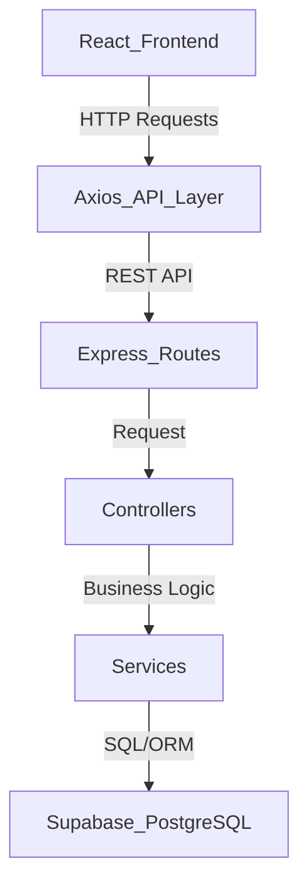

# MAL ERP/CRM

MAL ERP/CRM is a full-stack Enterprise Resource Planning and Customer Relationship Management application built using React, Express.js, Node.js, Tailwind CSS, and Supabase.

## Table of Contents
- [Features](#features)
- [Tech Stack](#tech-stack)
- [Project Structure](#project-structure)
- [Installation](#installation)
- [Environment Variables](#environment-variables)
- [Running the Application](#running-the-application)
- [Architecture](#architecture)
- [API Documentation](#api-documentation)
- [Test Credentials](#test-credentials)
- [Postman Collection](#postman-collection)
- [Deployment](#deployment)
- [Environment Variable Management](#environment-variable-management)
- [Assumptions](#assumptions)
- [Bonus Features](#bonus-features)
- [Project Links](#project-links)
- [License](#license)

## Features

-  **JWT Authentication** — Secure user sessions with role-based access control (Admin, Sales, Warehouse, Accounts).
-  **Role-based Access Control** — Granular permissions for different parts of the system.
-  **Customer CRM** — Manage customers, search, filter, and track follow-up notes.
-  **Product & Inventory Management** — Comprehensive product catalog management.
-  **Stock Movement Tracking** — Detailed stock movement logs with real-time updates.
-  **Sales Challan Management** — Create and track delivery challans and invoices.
-  **Automatic Challan Number Generation** — Auto-generated, sequential challan numbering.
-  **Product Snapshot Storage** — Accurate historical records with product snapshots stored in challans.
-  **PDF Export** — Export Sales Challan / Invoice as PDF.
-  **Low Stock Alerts** — Automated warnings when inventory drops below threshold.
-  **Pagination, Search & Filtering** — Efficient data retrieval and navigation across the application.
-  **Input Validation** — Robust data validation for all API inputs.
-  **Centralized Error Handling** — Clean, consistent error responses.

## Tech Stack

| Layer | Technology |
|-------|-----------|
| **Frontend** | React, Vite, Tailwind CSS |
| **Backend** | Node.js, Express.js, JavaScript |
| **Database** | Supabase PostgreSQL |
| **Auth** | JWT (bcrypt password hashing) |

## Project Structure

```
.
├── frontend/ (src/)          # Frontend React application
│   ├── components/          # Reusable UI components
│   ├── constants/           # App constants and config
│   ├── hooks/               # Custom React hooks
│   ├── pages/               # Route pages
│   ├── services/            # API service layer (Axios)
│   └── utils/               # Utility functions
├── backend/                  # Backend Express application
│   └── src/
│       ├── config/          # App config, Supabase client, constants
│       ├── controllers/     # Route controllers
│       ├── middleware/       # Auth, validation, error handling
│       ├── routes/           # Express routes
│       ├── services/         # Business logic services
│       ├── utils/            # Error classes, helpers
│       └── validators/       # Express-validator schemas
├── postman/                 # Postman collection
├── supabase/                # Supabase integration schema 
└── README.md
```

## Installation

### 1. Clone and install dependencies

```bash
# Install frontend dependencies
cd frontend
npm install

# Install backend dependencies
cd backend
npm install
```

### 2. Supabase Setup

The database schema is automatically created via Supabase migrations. The tables created are:

- **users** — Application users with roles
- **customers** — Customer CRM records
- **follow_up_notes** — Customer follow-up notes
- **products** — Product inventory
- **stock_movements** — Stock movement logs
- **sales_challans** — Sales challan records
- **sales_challan_items** — Individual challan line items with product snapshots

## Environment Variables

### Frontend (`frontend/.env`)

```env
VITE_API_URL=http://localhost:5000/api || BACKEND_URL
```

### Backend (`backend/.env`)

```env
PORT=5000
JWT_SECRET=your-super-secret-jwt-key
JWT_EXPIRES_IN=24h
CLIENT_URL=http://localhost:5173 || FRONTEND_URL
SUPABASE_URL=your-supabase-project-url
SUPABASE_SERVICE_ROLE_KEY=your-supabase-service-role-key
```

## Running the Application

To run the application locally, you will need to start both the backend server and the frontend development server.

### Backend Setup
1. Open a terminal and navigate to the backend directory:
```bash
cd backend
```
2. Start the backend development server:
```bash
npm run dev
```

### Frontend Setup
1. Open a new terminal and navigate to the frontend directory:
```bash
cd frontend
```
2. Start the frontend development server:
```bash
npm run dev
```
3. Open `http://localhost:5173` in your browser.

## Architecture

The application follows a standard multi-tier architecture to ensure separation of concerns and maintainability.

### Request Flow



### Layer Responsibilities
- **Routes:** Defines the API endpoints and maps them to the corresponding controller methods. Applies middleware (like authentication and validation) before hitting the controllers.
- **Controllers:** Handles incoming HTTP requests, extracts parameters/body, calls the appropriate service methods, and formats the HTTP response (success or error).
- **Services:** Contains the core business logic of the application. It interacts with the database (Supabase) to fetch, create, update, or delete records.
- **Middleware:** Intercepts requests for centralized tasks such as verifying JWT tokens (auth), validating input data, and catching/formatting errors.
- **Supabase:** The PostgreSQL database layer that handles data persistence, relationships, and some built-in features.

## API Documentation

The RESTful API requires JWT Bearer authentication for protected endpoints. The complete documentation, including request/response examples, is available in the Postman collection provided with this repository.

### Authentication
| Method | Endpoint | Description |
|--------|----------|-------------|
| POST | `/api/auth/login` | Login with email and password |
| GET | `/api/auth/me` | Get current user profile |

### Customers (CRM)
| Method | Endpoint | Description | Access |
|--------|----------|-------------|--------|
| GET | `/api/customers` | List customers (pagination, search, filter) | Admin, Sales, Accounts |
| GET | `/api/customers/:id` | Get customer details | Admin, Sales, Accounts |
| POST | `/api/customers` | Create new customer | Admin, Sales |
| PUT | `/api/customers/:id` | Update customer | Admin, Sales |
| DELETE | `/api/customers/:id` | Delete customer | Admin |
| POST | `/api/customers/:id/notes` | Add follow-up note | Admin, Sales |
| GET | `/api/customers/:id/notes` | Get customer notes | Admin, Sales, Accounts |

### Products & Inventory
| Method | Endpoint | Description | Access |
|--------|----------|-------------|--------|
| GET | `/api/products` | List products (pagination, low stock filter) | Admin, Warehouse |
| GET | `/api/products/:id` | Get product details | Admin, Warehouse |
| POST | `/api/products` | Create product | Admin, Warehouse |
| PUT | `/api/products/:id` | Update product | Admin, Warehouse |
| DELETE | `/api/products/:id` | Delete product | Admin |
| GET | `/api/products/inventory/movements` | List stock movements | Admin, Warehouse |
| POST | `/api/products/inventory/movements`| Log stock movement (IN/OUT) | Admin, Warehouse |

### Sales Challans
| Method | Endpoint | Description | Access |
|--------|----------|-------------|--------|
| GET | `/api/challans` | List challans (pagination, search, filter) | Authenticated |
| GET | `/api/challans/:id` | Get challan details with items | Authenticated |
| POST | `/api/challans` | Create challan (draft) | Admin, Sales, Accounts |
| PATCH | `/api/challans/:id/status` | Update challan status (confirm/cancel) | Admin, Sales, Accounts |

## Test Credentials

Seed users are automatically inserted for testing purposes. You can use the following credentials to log in:

| Email | Password | Role |
|-------|----------|------|
| admin@erp.com | password123 | admin |
| sales@erp.com | password123 | sales |
| warehouse@erp.com | password123 | warehouse |
| accounts@erp.com | password123 | accounts |

## Postman Collection

Import the collection from `postman/Enterprise ERP.postman_collection.json` to test all API endpoints.

## Deployment

### Frontend (Vercel)

1. Set `VITE_API_URL` to your backend URL
2. Build command: `npm run build`
3. Output directory: `dist`

### Backend (Render)

1. Set all environment variables in `backend/.env`
2. Start command: `npm start`
3. Health check: `/api/health`

### Database (Supabase)

Supabase: [link](https://supabase.com/)

## Environment Variable Management

The application uses `.env` files to manage configuration and secrets across environments. These files configure both frontend API connections and backend settings. They are explicitly excluded from version control using `.gitignore` to prevent leaking sensitive information and credentials.


## Assumptions

The system was designed with the following assumptions:
- **Authentication:** Standard JWT authentication is used for session management.
- **Security:** User passwords are encrypted using bcrypt password hashing.
- **Business Logic:**
  - Auto-generated challan numbers are sequential and unique.
  - Product snapshots are stored within challans to maintain historical accuracy even if product prices or details change later.
  - Stock cannot become negative; validation prevents issuing more stock than is available.
- **Access Control:** Role-based authorization dictates which features and data are accessible to users.
- **Notifications:** Low stock alerts are determined dynamically based on current stock levels versus a predefined minimum threshold.

## Bonus Features

In addition to the core requirements, this project implements several bonus features:
- **Export Sales Challan / Invoice as PDF** (implemented)
- **Role-based authentication**
- **Product snapshot storage**
- **Stock movement tracking**
- **Pagination, search, and filtering**

## Project Links

- **Live Frontend URL:** [https://mal-erp-crm.vercel.app/](https://mal-erp-crm.vercel.app/)
- **Live Backend API URL:** [https://https://mal-erp-crm.onrender.com/](https://https://mal-erp-crm.onrender.com/)
- **Supabase Project:** [https://supabase.com/](https://supabase.com/)

## License

MIT
